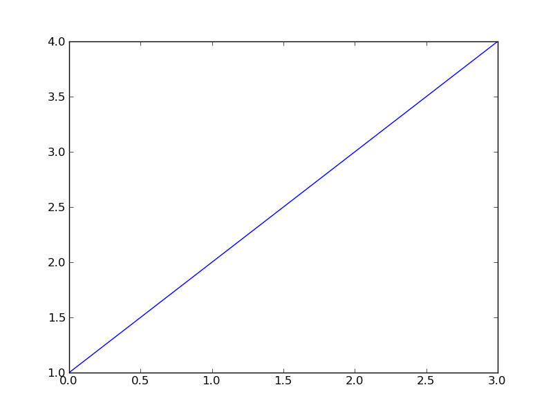

:author: Michael D. Pacer
:email: mpacer@berkeley.edu
:institution: University of California, Berkeley

:author: Jordan W. Suchow
:email: suchow@berkeley.edu
:institution: University of California, Berkeley

:video: http://www.youtube.com/watch?v=dhRUe-gz690

------------------------------------------------
Proselint
------------------------------------------------

.. class:: abstract

   Writing is notoriously hard, even for the best writers, and it's not for lack of good advice — a tremendous amount of knowledge is strewn across usage guides, dictionaries, technical manuals, essays, pamphlets, websites, and the hearts and minds of great authors and editors. But this knowledge is trapped, waiting to be extracted and transformed.

   We built Proselint, a Python-based linter for prose. Proselint identifies violations of expert style and usage guidelines. Proselint is open-source software released under the BSD license and works with Python 2 and 3. It runs as a command-line utility or editor plugin (e.g., Sublime Text, Atom, Vim, Emacs) and outputs advice in standard formats (e.g., JSON). Though in its infancy – perhaps 2% of what it could be – Proselint already includes modules addressing: redundancy, jargon, illogic, clichés, sexism, misspelling, inconsistency, misuse of symbols, malapropisms, oxymorons, security gaffes, hedging, apologizing, pretension. 

   Proselint can be seen as both a language tool for scientists and a tool for language science. On the one hand, it includes modules that promote clear and consistent prose in science writing. On the other, it measures language usage and explores the factors relevant to creating a useful linter.

.. class:: keywords

   linters, writing tools, copyediting

The problem 
-----------
Writing is notoriously hard, even for the best writers, and it's not for lack of good advice — a tremendous amount of knowledge about the craft is strewn across usage guides, dictionaries, technical manuals, essays, pamphlets, websites, and the hearts and minds of great authors and editors. But poring over Strunk & White hardly makes one a better writer — it turns you into neither Strunk nor White. And nobody has the willpower, time, or memory to  manually apply all the advice from Garner’s Modern English Usage (a 1,120-page usage guide) to everything they write. 
The knowledge is trapped, waiting to be extracted and transformed.

We built Proselint, a Python-based linter for prose. 
A linter is a computer program that, like a spell checker, scans through a document and analyzes it. 
Proselint identifies violations of expert style and usage guidelines. 

Proselint is open-source software released under the BSD license and works with Python 2 and 3. It runs efficiently as a command-line utility or editor plugin. It outputs advice in standard formats (e.g., JSON), integrating with Sublime Text, Atom, Vim, Emacs, and other editors and services. Though in its infancy – perhaps 2% of what it could be – Proselint already includes modules on a variety of usage problems: redundancy, jargon, illogic, clichés, sexism, misspelling, inconsistency, misuse of symbols, malapropisms, oxymorons, security gaffes, hedging, apologizing, pretension, and more. 

Consequences of designing a *linter* as opposed to just any writing aid:
========================================================================``

* responses needs to be in real time, limits processing that can occur
* responses should be relatively monotonic (i.e., we should minimise the number of lints that are due to sentences that have not yet been completed)
* it needs to be able to be installed and modified by the end-user
* 

our general approach
--------------------

Divide up problem types into levels of difficulty. 

Incorporate broader community. 
Open source license allows the community of users to become a community of builders. 
Given that many of the rules' implementations are particularly well-suited to novice coding projects.

existing tools
--------------

1Checker (http://www.1checker.com/)
AbiWord's grammar checker (http://www.abisource.com/)
After the Deadline (https://openatd.wordpress.com/)
Alex (http://alexjs.com/)
Autocrit (https://www.autocrit.com/editor/)
ClearEdits (http://www.clearwriter.com/clearedits.html)
CorrectEnglish (http://www.correctenglish.com/)
CKEditor (http://www.webspellchecker.net/)
Editor (http://www.serenity-software.com/)
The Editorium (http://www.editorium.com/ETKPlus2014.htm)
EditorSoftware (http://www.editorsoftware.com/)
Edminton (http://editminion.com/)
Expresso (http://expresso-app.org/)
Ghotit (http://www.ghotit.com/)
Ginger (http://www.gingersoftware.com/)
GNU Diction (https://www.gnu.org/software/diction/)
GNU Style (http://archive09.linux.com/feature/56833)
Grac (http://grac.sourceforge.net/)
GrammarBase (http://www.grammarbase.com/)
GrammarCheck (http://www.grammarcheck.net/)
Grammar Check Anywhere (https://www.spellcheckanywhere.com/grammar_check/)
Grammar Expert Plus (http://www.wintertree-software.com/app/gramxp/)
GrammarianPro (http://linguisoft.com/gramerrorfeatures.html)
Grammark (https://github.com/markfullmer/grammark)
Grammarly (https://www.grammarly.com/)
Grammar Slammer (http://englishplus.com/grammar/)
Grammatica (http://grammatica-english.soft32.com/)
Grammatik (https://en.wikipedia.org/wiki/Grammatik)
Graviax (http://graviax-grammar-checker.soft112.com/)
Hemmingway (http://www.hemingwayapp.com/desktop.html)
ivanistheone's scripts (https://github.com/ivanistheone/writing_scripts)
Language Tool (https://www.languagetool.org/)
Matt Might's shell scripts (http://matt.might.net/articles/shell-scripts-for-passive-voice-weasel-words-duplicates/)
Microsoft Word's grammar check (https://support.office.com/en-us/article/Check-spelling-and-grammar-cab319e8-17df-4b08-8c6b-b868dd2228d1)
OnlineCorrection.com (http://www.onlinecorrection.com/)
PaperRater (https://www.paperrater.com/)
PerfectIt (http://www.intelligentediting.com/)
ProWritingAid (https://prowritingaid.com/)
Reverso (http://www.reverso.net/)
RightWriter (http://www.right-writer.com/)
Rousseau (https://github.com/GitbookIO/rousseau)
SpellCheckPlus (http://spellcheckplus.com/)
Stilus (http://www.mystilus.com/Main)
Textanz (http://www.textanz.com/)
Virtual Writing Tutor (http://virtualwritingtutor.com/)
Wave (https://en.wikipedia.org/wiki/Apache_Wave)
WhiteSmoke (http://www.whitesmoke.com/)
WordPerfect (http://www.wordperfect.com/us/)
WinProof (http://www.franklinhu.com/winproof.htm)
WordRake (http://www.wordrake.com/)
write-good (https://github.com/btford/write-good)
Writer's Workbench (http://www.emo.com/)

the principles we've identified
-------------------------------

how our tool address or uses each of those principles
-----------------------------------------------------

sourcing of advice and what kinds we found
------------------------------------------

example of some rules
---------------------

Proselint can be seen as both a language tool for scientists and a tool for language science. On the one hand, it can be used to improve writing, and it includes modules that promote clear and consistent prose in science writing. On the other, it can measure language usage and explore the factors relevant to creating a useful linter.

Proselint is unlike other language linters. First, Proselint does not focus on grammar, which is AI-complete, requiring human-level intelligence to get right. Instead, we consider usage and style. Second, existing tools for improving prose raise so many false alarms that their advice is distrusted and ignored. Proselint's motto is 'Better to be silent than wrong', aiming for a precision that makes it possible to adopt its recommendations unquestioningly. We optimize a "lintscore" metric that penalizes false positives.

Proselint is a massive undertaking, one that will require the ethos of an open source community to complete. Garner’s book alone has 11,000 entries. Half are easy, assignable as a homework problem (e.g., that “very unique” compares an uncomparable adjective, or that people from Michigan prefer to be called “Michiganders”, not “Michiganians”). Thirty percent are moderately challenging, requiring custom tooling. Fifteen percent are hard — projects that require advances in AI and NLP. Everything else, around five percent (the best five percent), is AI-complete.

We will discuss where Proselint is and where it is heading. We will show its installation and application, demonstrating its use on the repository of papers submitted to SciPy2016.

Proselint is fertile ground for growing an open-source community. It has trivial subproblems and lofty goals, an immediate impact and a long future.

Approach
--------

Check usage, not grammar
^^^^^^^^^^^^^^^^^^^^^^^^

proselint does not focus on grammar, which is at once too easy and too hard — too easy because, for most native speakers, it comes naturally; too hard because, in its most general form, detecting grammatical errors is AI-complete, requiring human-level intelligence to get things right. Instead, we consider usage: redundancy, jargon, illogic, clichés, sexism, misspelling, inconsistency, misuse of symbols, malapropisms, oxymorons, security gaffes, hedging, apologizing, pretension, and more.

Be precise
^^^^^^^^^^
proselint is precise. Existing tools for improving prose raise so many false alarms that their advice can not be trusted. Instead, the writer must carefully consider whether to accept or reject each change. We aim for a tool so precise that it becomes possible to unquestioningly adopt its recommendations and still come out ahead — with stronger, tighter prose. Better to be quiet and authoritative than loud and unreliable. We measure the performance of proselint by tracking its lintscore.

Source advice from experts
^^^^^^^^^^^^^^^^^^^^^^^^^^
proselint defers to the world’s greatest writers and editors. We didn’t make up this advice on our own. Instead, we aggregated their expertise, giving you direct access to humanity’s collective understanding about the craft of writing.

Bibliographies, citations and block quotes
------------------------------------------

If you want to include a ``.bib`` file, do so above by placing  :code:`:bibliography: yourFilenameWithoutExtension` as above (replacing ``mybib``) for a file named :code:`yourFilenameWithoutExtension.bib` after removing the ``.bib`` extension. 

**Do not include any special characters that need to be escaped or any spaces in the bib-file's name**. Doing so makes bibTeX cranky, & the rst to LaTeX+bibTeX transform won't work. 

To reference citations contained in that bibliography use the :code:`:cite:`citation-key`` role, as in :cite:`hume48` (which literally is :code:`:cite:`hume48`` in accordance with the ``hume48`` cite-key in the associated ``mybib.bib`` file).

However, if you use a bibtex file, this will overwrite any manually written references. 

So what would previously have registered as a in text reference ``[Atr03]_`` for 

:: 

     [Atr03] P. Atreides. *How to catch a sandworm*,
           Transactions on Terraforming, 21(3):261-300, August 2003.

what you actually see will be an empty reference rendered as **[?]**.

E.g., [Atr03]_.

If you wish to have a block quote, you can just indent the text, as in 

    When it is asked, What is the nature of all our reasonings concerning matter of fact? the proper answer seems to be, that they are founded on the relation of cause and effect. When again it is asked, What is the foundation of all our reasonings and conclusions concerning that relation? it may be replied in one word, experience. But if we still carry on our sifting humor, and ask, What is the foundation of all conclusions from experience? this implies a new question, which may be of more difficult solution and explication. :cite:`hume48`

Source code examples
--------------------

Of course, no paper would be complete without some source code.  Without
highlighting, it would look like this::

   def sum(a, b):
       """Sum two numbers."""

       return a + b

With code-highlighting:

.. code-block:: python

   def sum(a, b):
       """Sum two numbers."""

       return a + b

Maybe also in another language, and with line numbers:

.. code-block:: c
   :linenos:

   int main() {
       for (int i = 0; i < 10; i++) {
           /* do something */
       }
       return 0;
   }

Or a snippet from the above code, starting at the correct line number:

.. code-block:: c
   :linenos:
   :linenostart: 2

   for (int i = 0; i < 10; i++) {
       /* do something */
   }
 
Important Part
--------------

It is well known [Atr03]_ that Spice grows on the planet Dune.  Test
some maths, for example :math:`e^{\pi i} + 3 \delta`.  Or maybe an
equation on a separate line:

.. math::

   g(x) = \int_0^\infty f(x) dx

or on multiple, aligned lines:

.. math::
   :type: eqnarray

   g(x) &=& \int_0^\infty f(x) dx \\
        &=& \ldots

The area of a circle and volume of a sphere are given as

.. math::
   :label: circarea

   A(r) = \pi r^2.

.. math::
   :label: spherevol

   V(r) = \frac{4}{3} \pi r^3

We can then refer back to Equation (:ref:`circarea`) or
(:ref:`spherevol`) later.

Mauris purus enim, volutpat non dapibus et, gravida sit amet sapien. In at
consectetur lacus. Praesent orci nulla, blandit eu egestas nec, facilisis vel
lacus. Fusce non ante vitae justo faucibus facilisis. Nam venenatis lacinia
turpis. Donec eu ultrices mauris. Ut pulvinar viverra rhoncus. Vivamus
adipiscing faucibus ligula, in porta orci vehicula in. Suspendisse quis augue
arcu, sit amet accumsan diam. Vestibulum lacinia luctus dui. Aliquam odio arcu,
faucibus non laoreet ac, condimentum eu quam. Quisque et nunc non diam
consequat iaculis ut quis leo. Integer suscipit accumsan ligula. Sed nec eros a
orci aliquam dictum sed ac felis. Suspendisse sit amet dui ut ligula iaculis
sollicitudin vel id velit. Pellentesque hendrerit sapien ac ante facilisis
lacinia. Nunc sit amet sem sem. In tellus metus, elementum vitae tincidunt ac,
volutpat sit amet mauris. Maecenas [#]_ diam turpis, placerat [#]_ at adipiscing ac,
pulvinar id metus.

.. [#] On the one hand, a footnote.
.. [#] On the other hand, another footnote.

   This is the caption. :label:`egfig`

   This is a wide figure, specified by adding "w" to the figclass.  It is also
   center aligned, by setting the align keyword (can be left, right or center).

   This is the caption on a smaller figure that will be placed by default at the
   bottom of the page, and failing that it will be placed inline or at the top.
   Note that for now, scale is relative to a completely arbitrary original
   reference size which might be the original size of your image - you probably
   have to play with it. :label:`egfig2`

As you can see in Figures :ref:`egfig` and :ref:`egfig2`, this is how you reference auto-numbered
figures.

.. table:: This is the caption for the materials table. :label:`mtable`

   +------------+----------------+
   | Material   | Units          |
   +============+================+
   | Stone      | 3              |
   +------------+----------------+
   | Water      | 12             |
   +------------+----------------+
   | Cement     | :math:`\alpha` |
   +------------+----------------+

We show the different quantities of materials required in Table
:ref:`mtable`.

.. The statement below shows how to adjust the width of a table.

.. raw:: latex

   \setlength{\tablewidth}{0.8\linewidth}

.. table:: This is the caption for the wide table.
   :class: w

   +--------+----+------+------+------+------+--------+
   | This   | is |  a   | very | very | wide | table  |
   +--------+----+------+------+------+------+--------+

Unfortunately, restructuredtext can be picky about tables, so if it simply
won't work try raw LaTeX:

.. raw:: latex

   \begin{table*}

     \begin{longtable*}{|l|r|r|r|}
     \hline
     \multirow{2}{*}{Projection} & \multicolumn{3}{c|}{Area in square miles}\tabularnewline
     \cline{2-4}
      & Large Horizontal Area & Large Vertical Area & Smaller Square Area\tabularnewline
     \hline
     Albers Equal Area  & 7,498.7 & 10,847.3 & 35.8\tabularnewline
     \hline
     Web Mercator & 13,410.0 & 18,271.4 & 63.0\tabularnewline
     \hline
     Difference & 5,911.3 & 7,424.1 & 27.2\tabularnewline
     \hline
     Percent Difference & 44\% & 41\% & 43\%\tabularnewline
     \hline
     \end{longtable*}

     \caption{Area Comparisons \DUrole{label}{quanitities-table}}

   \end{table*}

Perhaps we want to end off with a quote by Lao Tse [#]_:

  *Muddy water, let stand, becomes clear.*

.. [#] :math:`\mathrm{e^{-i\pi}}`

.. Customised LaTeX packages
.. -------------------------

.. Please avoid using this feature, unless agreed upon with the
.. proceedings editors.

.. ::

..   .. latex::
..      :usepackage: somepackage

..      Some custom LaTeX source here.

References
----------
.. [Atr03] P. Atreides. *How to catch a sandworm*,
           Transactions on Terraforming, 21(3):261-300, August 2003.

